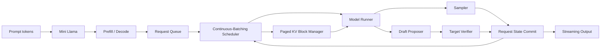

# LLM Serving Lab

An educational, executable path from **single-token generation** to
**continuous batching**, **paged KV-cache management**, and
**speculative decoding**.

The project combines three kinds of evidence:

- Original, minimal implementations of the core mechanisms.
- Execution traces that make state transitions visible.
- Source-level maps to pinned llama2.c, vLLM, and DeepSpec revisions.

It is designed for learning and systems interviews. It is not a replacement
for a production inference engine.

## Architecture



## What is implemented

### Mini Llama

- NumPy implementation of RMSNorm, RoPE, GQA, causal attention, and SwiGLU.
- Full-prompt prefill and one-token decode with a per-layer KV cache.
- Greedy and top-p sampling.
- Cached-versus-uncached generation traces and correctness tests.

### Mini Serving Runtime

- Waiting, running, and finished request states.
- FCFS continuous batching.
- Token-budget scheduling and chunked prefill.
- Fixed-size physical KV blocks and logical-to-physical slot mapping.
- Deterministic model runner for CPU-only scheduling experiments.
- JSONL events for every scheduling, execution, and output transition.

### Speculative Decoding

- Draft proposer and target verifier interfaces.
- Lossless greedy accepted-prefix verification.
- Rejected-suffix handling and bonus tokens.
- A load-aware confidence scheduler inspired by DSpark.
- Fixed-length and confidence-scheduled simulation experiments.

### Framework tracing

- An opt-in adapter that traces selected vLLM V1 scheduler, KV allocation,
  and output-processing boundaries without vendoring vLLM.
- A normalized DSpark round schema.
- SVG visualizers for request timelines, KV-block ownership, and acceptance.

## Quick start

Python 3.10 or newer is required. The recommended environment manager is
[uv](https://docs.astral.sh/uv/).

```bash
uv sync --extra dev
uv run pytest
uv run ruff check .
```

Run the three smallest demos:

```bash
uv run llm-serving-demo model
uv run llm-serving-demo serving
uv run llm-serving-demo speculative
```

Run the scheduler and speculative-decoding experiments:

```bash
make demo
make demo-spec
make visualize
```

Generated artifacts are written to `results/generated/`.

## Example execution trace

The scheduler experiment admits three requests with different prompt and
output lengths. Each JSONL event records its state transition:

```json
{
  "kind": "request_scheduled",
  "step": 1,
  "request_id": "A",
  "fields": {
    "phase": "decode",
    "num_computed_tokens": 3,
    "num_scheduled_tokens": 1,
    "block_ids": [0],
    "slot_mapping": [3]
  }
}
```

Curated examples:

- [Request scheduling timeline](results/figures/scheduler_timeline.svg)
- [KV-block ownership](results/figures/kv_blocks.svg)
- [Speculative acceptance](results/figures/speculative_acceptance.svg)
- [Measured vLLM scheduler trace](results/figures/vllm_scheduler_trace.svg)
- [Measured DSpark verification rounds](results/figures/dspark_verification_rounds.svg)
- [Sample scheduler trace](results/sample_traces/scheduler_trace.jsonl)
- [Sample speculative summary](results/sample_traces/speculative_summary.json)

## Measured GPU smoke tests

The repository includes two small, reproducible GPU artifacts recorded on a
Quadro RTX 8000. They validate the instrumentation path; they are not production
benchmarks.

| Runtime | Workload | Observed result |
|---|---|---|
| vLLM | 3 requests, 26 input and 48 output tokens | 0.465 s batch, 103.3 output tok/s |
| DeepSpec DSpark | 1 GSM8K sample, seven 7-token proposals | 5.57 mean accepted draft tokens |

See the [GPU reproduction guide](docs/10_gpu_reproduction.md), including exact
revision, environment, dirty-state, and methodology limitations.

## Source-level study map

The local study was performed against these immutable revisions:

| Project | Revision | Role in this lab |
|---|---|---|
| karpathy/llama2.c | `350e04f` | Minimal one-token generation state machine |
| vllm-project/vllm | `ff6173997` | Scheduler, paged KV cache, model runner, serving |
| DeepSpec | `005e03b` | DSpark draft and verification reference path |

The implementation does not copy these projects. See
[third-party attribution](third_party/README.md) and the detailed
[source map](docs/03_vllm_source_map.md).

## Repository guide

```text
src/llm_serving_lab/mini_llm/       Llama-style decoder and KV cache
src/llm_serving_lab/mini_serving/   Scheduler, block manager, engine
src/llm_serving_lab/speculative/    Proposer, verifier, confidence scheduler
src/llm_serving_lab/tracing/        JSONL schema and framework adapters
experiments/                        Reproducible CPU and opt-in GPU experiments
visualization/                      Dependency-free SVG generators
tests/                              Correctness and invariant tests
docs/                               Execution-level explanations
results/                            Curated sample traces and figures
```

## Correctness invariants

The test suite emphasizes state-machine correctness:

```text
cached logits ≈ full-forward logits
cached generation == uncached generation
scheduled tokens <= token budget
allocated blocks + free blocks == total blocks
finished requests release all physical blocks
chunked prefill output == unchunked prefill output
speculative greedy output == target greedy output
rejected draft suffix is never emitted
```

## Trace a local vLLM checkout

Install the pinned vLLM checkout in its own environment, then install this
project into the same environment. Run:

```bash
VLLM_ENABLE_V1_MULTIPROCESSING=0 \
VLLM_USE_V2_MODEL_RUNNER=0 \
python examples/trace_vllm.py \
  --model Qwen/Qwen3-8B \
  --output results/generated/vllm_trace.jsonl
```

The adapter is intentionally version-aware and opt-in. Monkey-patching a
production server is not recommended.

## Interpreting the DSpark component

This repository separates three commonly conflated layers:

1. DeepSpec's readable, offline DSpark evaluator.
2. vLLM's static DSpark draft/verification runtime in the pinned revision.
3. Full load-aware confidence scheduling described by the DSpark system.

The local confidence scheduler is an educational policy over prefix-survival
probabilities and a configurable load profile. It does **not** claim to
reproduce DeepSeek's private production hardware profile.

See [DSpark execution notes](docs/05_dspark_execution.md) and
[limitations](docs/07_limitations.md).

## Reproducing results

Every reported number should include:

- Git revision and dirty-state status.
- Hardware and software environment.
- Target and draft model identifiers.
- Prompt/output length distributions.
- Sampling parameters and random seeds.
- Whether the result is measured GPU serving or algorithmic simulation.

The checked-in CPU demonstrations and GPU smoke tests are kept in separate
directories. The smoke tests establish executable integration, not comparative
speedup. A full measurement matrix is provided in
[the experiment guide](docs/06_experiments.md).

## Documentation

- [Twelve-week source-reading roadmap](docs/00_study_roadmap.md)
- [Token generation and KV cache](docs/01_token_generation.md)
- [Continuous batching and paged KV cache](docs/02_serving_runtime.md)
- [vLLM source map](docs/03_vllm_source_map.md)
- [Speculative decoding correctness](docs/04_speculative_decoding.md)
- [DSpark execution path](docs/05_dspark_execution.md)
- [Experiment methodology](docs/06_experiments.md)
- [Limitations](docs/07_limitations.md)
- [GitHub publishing checklist](docs/08_github_publishing.md)
- [Resume presentation](docs/09_resume_presentation.md)
- [GPU reproduction guide](docs/10_gpu_reproduction.md)

## License

Original code in this repository is released under the MIT License. Upstream
projects and model checkpoints retain their own licenses.
