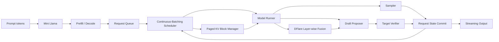

# LLM Serving Lab

An educational, executable path from **single-token generation** to
**continuous batching**, **paged KV-cache management**, and
**speculative decoding**.

The project combines four kinds of evidence:

- Original, minimal implementations of the core mechanisms.
- Execution traces that make state transitions visible.
- Source-level maps to pinned llama2.c, vLLM, and DeepSpec revisions.
- A controlled vLLM V2 comparison of AR, EAGLE3, DFlash, DFlare, and DSpark.

It is designed for learning and systems interviews. It is not a replacement
for a production inference engine.

## Architecture



## What is implemented

### Mini Llama

- NumPy implementation of RMSNorm, RoPE, GQA, causal attention, and SwiGLU.
- Full-prompt prefill and one-token decode with a per-layer KV cache.
- Greedy and top-p sampling.
- Cached-versus-uncached generation traces and correctness tests.

### Mini Serving Runtime

- Waiting, running, and finished request states.
- FCFS continuous batching.
- Token-budget scheduling and chunked prefill.
- Fixed-size physical KV blocks and logical-to-physical slot mapping.
- Deterministic model runner for CPU-only scheduling experiments.
- JSONL events for every scheduling, execution, and output transition.

### Speculative Decoding

- Draft proposer and target verifier interfaces.
- Lossless greedy accepted-prefix verification.
- Rejected-suffix handling and bonus tokens.
- A load-aware confidence scheduler inspired by DSpark.
- Fixed-length and confidence-scheduled simulation experiments.
- One typed benchmark contract shared by AR, EAGLE3, DFlash, DFlare, and
  DSpark, with workload fingerprints and AR token equality gates.

### DFlare learning track

- Independent NumPy model of per-draft-layer target-feature fusion.
- Masked block proposal connected to the same lossless greedy verifier.
- Normalized round traces covering proposal, acceptance, rejection, and commit.
- Isolated AngelSlim runner for official Qwen3-4B DFlare/DFlash checkpoints.
- Portable experimental vLLM V1/V2 patch series with RTX 8000 end-to-end
  execution.

### Framework tracing

- An opt-in adapter that traces selected vLLM V1 scheduler, KV allocation,
  and output-processing boundaries without vendoring vLLM.
- A normalized DSpark round schema.
- SVG visualizers for request timelines, KV-block ownership, and acceptance.

## Quick start

Python 3.10 or newer is required. The recommended environment manager is
[uv](https://docs.astral.sh/uv/).

```bash
uv sync --extra dev
uv run python -m pytest
uv run ruff check .
```

Run the three smallest demos:

```bash
uv run llm-serving-demo model
uv run llm-serving-demo serving
uv run llm-serving-demo speculative
```

Run the scheduler and speculative-decoding experiments:

```bash
make demo
make demo-spec
make demo-dflare
make visualize
```

Generated artifacts are written to `results/generated/`.

## Recommended learning and execution tutorial

Follow the stages in order. Stages 1–9 are the learning path; stage 10 joins
the mechanisms in one real vLLM experiment. Commands were rerun on 2026-09-17
with Python 3.12.13 and two Quadro RTX 8000 GPUs. CPU stages need only the
project environment. GPU stages additionally need the pinned external vLLM or
DeepSpec environment and local checkpoints; model weights are not stored in
this repository.

### 1. Install and check the repository

```bash
cd ~/llm-serving-lab
uv sync --extra dev
make test
uv run ruff check .
```

Success means all tests pass and Ruff prints `All checks passed!`. The current
suite contains 37 tests. Use `make test` or `uv run python -m pytest`; do not
use the bare `uv run pytest` entry point, because its console-script import path
does not include the repository-level `experiments` package.

### 2. Mini Llama: follow one token through the model

Read `src/llm_serving_lab/mini_llm/` in this order:

```text
config.py → model.py → cache.py → sampling.py → generate.py
```

Then run:

```bash
uv run llm-serving-demo model
```

The JSON output should contain one `prefill` step followed by three `decode`
steps. Prefill consumes shape `[1, 3]`; each decode consumes `[1, 1]`, and
`cache_length_after` increases by one. This is the smallest executable path
from prompt tokens to sampled tokens.

### 3. Mini Serving: scheduling and Paged KV cache

Read `request.py`, `scheduler.py`, `block_manager.py`, `model_runner.py`, and
finally `engine.py` under `src/llm_serving_lab/mini_serving/`. Run both the
compact demo and the trace-producing experiment:

```bash
uv run llm-serving-demo serving
make demo
```

The first command finishes the `short` and `long` requests. The experiment
writes `results/generated/scheduler_trace.jsonl`; the checked configuration
finishes requests B, A, and C in nine engine steps. Inspect a few events with:

```bash
sed -n '1,5p' results/generated/scheduler_trace.jsonl
```

Look for `request_scheduled`, its prefill/decode phase, physical `block_ids`,
and logical-to-physical `slot_mapping`.

### 4. Generic speculative decoding

Read `interfaces.py → verifier.py → decoder.py` under
`src/llm_serving_lab/speculative/`. The proposer may be approximate, but the
target verifier commits only a correct prefix plus a target/bonus token.

```bash
uv run llm-serving-demo speculative
make demo-spec
```

The compact demo must print `"matches_autoregressive": true`. The experiment
writes `results/generated/speculative_summary.json`; every fixed-length and
confidence-scheduled row must also match AR. These are algorithmic target-call
counts, not measured GPU kernel speedups.

### 5. EAGLE3: autoregressive multi-token drafting

Use EAGLE3 as the first real draft-model design because it preserves an
autoregressive dependency between proposed tokens. Start from the generic
verifier above, then follow the EAGLE3 model and proposer paths in the pinned
vLLM checkout described by `docs/11_unified_speculative_benchmark.md`.

The released DeepSpec Qwen3 checkpoint uses a training-code architecture name.
Create a vLLM-compatible view that symlinks, rather than copies, its weights:

```bash
uv run python experiments/prepare_deepspec_checkpoint.py \
  --source <DEEPSPEC_EAGLE3_SNAPSHOT> \
  --output <EAGLE3_VLLM_VIEW>
```

The output directory must contain `config.json`, a symlink to the weights,
architecture `Eagle3Qwen3ForCausalLM`, and five auxiliary layer IDs. Its actual
GPU execution is checked together with the other methods in stage 10.

### 6. DFlash: block-parallel proposal

DFlash replaces serial drafting with a masked/block-parallel proposal. Compare
`SharedFusion` and `DFlashProposer` in `src/llm_serving_lab/dflare/`, then run:

```bash
make demo-dflare
```

In `results/generated/dflare_educational.json`, inspect the
`dflash_shared_fusion` row and require `matches_autoregressive: true`. The
weights are deliberately random, so a low or zero accepted-token count is not
a failure and must not be presented as a performance result.

The real block-7 DFlash checkpoint is packaged as `Qwen3DSparkModel` with
`markov_rank=0`. The unified runner validates this contract and uses the
compatible anchor-sampling execution layout while retaining the DFlash label.

### 7. DFlare: layer-wise target-feature fusion

Read `features.py → fusion.py → proposal.py` under
`src/llm_serving_lab/dflare/`. Contrast DFlare's per-draft-layer target context
with DFlash's shared fusion. The same command from stage 6 writes the
`dflare_layerwise_fusion` row and a detailed trace:

```bash
make demo-dflare
sed -n '1,5p' results/generated/dflare_educational_trace.jsonl
```

Require lossless equality, then inspect proposal, verification, rejection, and
commit events. For the real GPU path, the repository applies the patch series
under `integrations/vllm/patches/unified/`. The available DFlare checkpoint was
trained with block 16 and is explicitly marked `runtime_truncated` when the
comparison uses runtime `K=7`.

### 8. DSpark: refinement, confidence, and scheduling

Read `docs/05_dspark_execution.md`, then revisit the `confidence` rows produced
by `make demo-spec`. They demonstrate how concurrency changes the proposal
budget. For a one-sample real DeepSpec trace, run:

```bash
uv run python experiments/run_dspark_gpu_experiment.py \
  --harness-root <DEEPSPEC_HARNESS> \
  --target-path <QWEN3_8B_SNAPSHOT> \
  --draft-path <DSPARK_BLOCK7_SNAPSHOT> \
  --gpu 0 \
  --max-samples 1 \
  --max-new-tokens 8 \
  --output-dir results/generated/dspark_gpu_smoke
```

Success produces `result.json` and `trace.rank0.jsonl`. The 2026-09-17 smoke
loaded `Qwen3DSparkModel`, proposed three seven-token blocks, and reported mean
acceptance length 3.67. One sample validates execution and trace wiring, not
throughput or model quality.

### 9. Read traces as execution timelines

Trace visualization is an observation tool used across the earlier stages,
not a separate decoding algorithm. Generate the CPU figures with:

```bash
make visualize
```

This creates:

- `scheduler_timeline.svg`: which requests run prefill or decode at each step;
- `kv_blocks.svg`: physical KV-block ownership and slot placement;
- `speculative_acceptance.svg`: accepted draft length versus proposal policy.

Render the checked-in real GPU traces with:

```bash
make visualize-measured
make plot-unified
```

The resulting SVGs cover vLLM scheduling, DSpark verification rounds, and the
five-method comparison. Each plot is generated from JSON/JSONL artifacts, so
the result can be audited without rerunning a checkpoint.

### 10. Run all methods under one vLLM contract

Apply the patch series in `integrations/vllm/README.md`, prepare the checkpoint
views, and execute:

```bash
PYTHONPATH=$PWD/src <VLLM_PYTHON> \
  experiments/run_unified_spec_benchmark.py \
  --python <VLLM_PYTHON> \
  --vllm-root <PATCHED_VLLM> \
  --config experiments/configs/unified_spec_qwen3_8b_rtx8000.json \
  --workload experiments/workloads/unified_qwen3_8b_v1.jsonl \
  --target-path <QWEN3_8B_SNAPSHOT> \
  --draft eagle3=<EAGLE3_VLLM_VIEW> \
  --draft dflash=<DFLASH_BLOCK7_SNAPSHOT> \
  --draft dflare=<DFLARE_BLOCK16_SNAPSHOT> \
  --draft dspark=<DSPARK_BLOCK7_SNAPSHOT> \
  --gpu 0 \
  --output-dir results/generated/unified_spec_qwen3_8b_rtx8000_fp16
```

The general runner records contention but does not accept
`--require-exclusive`; that option belongs to
`experiments/run_rtx4090_validation.py`. Accept a unified run only when:

```text
measurement_validity.status == "valid"
all_speculative_outputs_match_ar_until_stop == true
every stable_across_repetitions == true
every speculative num_speculative_tokens == 7
```

### 11. Move from RTX 8000 to RTX 4090

RTX 8000 is SM75, uses FP16 and the Triton attention fallback in this setup.
RTX 4090 is SM89 and should use a fresh environment, BF16, and freshly built
CUDA/Triton/FlashAttention artifacts. Do not copy compiled caches between the
cards. Run the one-command 4090 validator from
`docs/11_unified_speculative_benchmark.md`; unlike the general runner it can
enforce exclusivity with `--require-exclusive` and produces native-width,
precision-control, and matched-`K=7` lanes.

### 12. Verification record and known issues

| Stage | 2026-09-17 local verification | Evidence |
|---|---|---|
| Install/test/lint | passed | 37 tests; Ruff clean |
| Mini Llama | passed | one prefill + three decode steps |
| Mini Serving | passed | three requests; nine engine steps; JSONL trace |
| Generic speculative decoding | passed | every row matches AR |
| DFlash/DFlare educational model | passed | both use the lossless verifier; trace written |
| EAGLE3 unified GPU path | passed | stable; lossless through EOS; K=7 |
| DFlash unified GPU path | passed | 38.43% draft-token acceptance; K=7 |
| DFlare unified GPU path | passed | 42.10% draft-token acceptance; runtime K=7 |
| DSpark standalone smoke | passed | one GSM8K sample; mean accepted length 3.67 |
| DSpark unified GPU path | passed | 45.97% draft-token acceptance; K=7 |
| Trace/SVG generation | passed | all expected SVG files are non-empty |
| Unified RTX 8000 run | passed | no contention; all methods stable and lossless to EOS |

Two repository issues were found and fixed during this walkthrough:

1. `uv run pytest` could not import the repository-level `experiments` package;
   the supported test command and Make target now use `python -m pytest`.
2. A previous worker's short-lived GPU utilization tail could be mistaken for
   external contention. The runner now waits for a stable idle snapshot when
   external compute allocation is below 512 MiB, while preserving immediate
   rejection of genuinely occupied devices.

Expected RTX 8000 warnings include FlashAttention 2 being unavailable on SM75
and fallback to Triton attention. The educational DFlash/DFlare acceptance
numbers come from random weights and are correctness demonstrations only.

## Example execution trace

The scheduler experiment admits three requests with different prompt and
output lengths. Each JSONL event records its state transition:

```json
{
  "kind": "request_scheduled",
  "step": 1,
  "request_id": "A",
  "fields": {
    "phase": "decode",
    "num_computed_tokens": 3,
    "num_scheduled_tokens": 1,
    "block_ids": [0],
    "slot_mapping": [3]
  }
}
```

Curated examples:

- [Request scheduling timeline](results/figures/scheduler_timeline.svg)
- [KV-block ownership](results/figures/kv_blocks.svg)
- [Speculative acceptance](results/figures/speculative_acceptance.svg)
- [Measured vLLM scheduler trace](results/figures/vllm_scheduler_trace.svg)
- [Measured DSpark verification rounds](results/figures/dspark_verification_rounds.svg)
- [Measured AR/DFlash/DFlare comparison](results/figures/dflare_rtx8000_fp16_comparison.svg)
- [Unified AR/EAGLE3/DFlash/DFlare/DSpark comparison](results/figures/unified_spec_qwen3_8b_rtx8000_fp16.svg)
- [Sample scheduler trace](results/sample_traces/scheduler_trace.jsonl)
- [Sample speculative summary](results/sample_traces/speculative_summary.json)

## Unified local GPU comparison

The primary comparison now runs all five methods through one clean vLLM
revision, one Qwen3-8B target, one immutable workload, one V2 GPU model runner,
and one trace schema. The checked-in RTX 8000 run is lossless through EOS for
every method.

| Method | Runtime K | Checkpoint block | Median output tok/s | vs AR | committed/step | Draft acceptance |
|---|---:|---:|---:|---:|---:|---:|
| AR | 0 | — | 236.13 | 1.000× | 1.000 | — |
| EAGLE3 | 7 | 7 | 225.18 | 0.954× | 2.558 | 24.48% |
| DFlash | 7 | 7 | 393.58 | 1.667× | 3.429 | 38.43% |
| DFlare | 7 | 16 (truncated) | 384.87 | 1.630× | 3.600 | 42.10% |
| DSpark | 7 | 7 | 432.35 | 1.831× | 3.847 | 45.97% |

The previous DFlash row used a different z-lab block-16 checkpoint and
accepted zero draft tokens, so its 68.66 tok/s result measured proposer
overhead without speculative progress and did not satisfy the equal-`K`
contract. The corrected row uses
`deepseek-ai/dflash_qwen3_8b_block7@9e44dbbb6c`, accepts 382 of 994 proposed
tokens, and reaches 393.58 tok/s in the isolated rerun. This checkpoint is
packaged as a `Qwen3DSparkModel` with `markov_rank=0`, so it uses the compatible
anchor sampling runtime while remaining labeled as the DFlash algorithm.

DFlare also runs with `K=7`, but the available released checkpoint was trained
with block 16. Its row therefore controls runtime verifier width by truncation;
it is not a native block-7 training ablation. EAGLE3, DFlash, and DSpark use
native block-7 checkpoints. All four speculative methods match AR token for
token through the first EOS and are stable across the three measured rounds.

This checked-in run passed the automatic isolation gate: every pre-method
snapshot observed 0% utilization and only the 26 MiB CUDA MPS daemon, so the
machine-readable result sets `benchmark_claim=true`. The numbers describe one
fixed offline eager batch on this RTX 8000; they are not online-serving or RTX
4090 claims. See the [stage report](reports/unified/stage-03-rtx8000-results.md)
and [unified protocol](docs/11_unified_speculative_benchmark.md).

For RTX 4090 validation, the one-command runner executes the full BF16 native
comparison, a DFlash BF16/FP16 control, and a matched-runtime-width `K=7`
comparison. It records exact per-position draft acceptance and produces
`REPORT.md`, JSON, traces, and SVG figures. See
[the 4090 command](docs/11_unified_speculative_benchmark.md#one-command-rtx-4090-validation).

## Earlier GPU smoke tests

The repository includes small, reproducible GPU artifacts recorded on a
Quadro RTX 8000. They validate the instrumentation path; they are not production
benchmarks.

| Runtime | Workload | Observed result |
|---|---|---|
| vLLM | 3 requests, 26 input and 48 output tokens | 0.465 s batch, 103.3 output tok/s |
| DeepSpec DSpark | 1 GSM8K sample, seven 7-token proposals | 5.57 mean accepted draft tokens |
| AngelSlim DFlare | 4 requests, 128 output tokens, FP16/SDPA | exact AR output; 4.40 mean committed tokens/round |
| Patched vLLM DFlare | 3 requests, 24 output tokens, eager FP16 | exact AR output; end-to-end V1 path passed |

See the [GPU reproduction guide](docs/10_gpu_reproduction.md), including exact
revision, environment, dirty-state, and methodology limitations.

## Source-level study map

The local study was performed against these immutable revisions:

| Project | Revision | Role in this lab |
|---|---|---|
| karpathy/llama2.c | `350e04f` | Minimal one-token generation state machine |
| vllm-project/vllm | `ff6173997` | Scheduler, paged KV cache, model runner, serving |
| DeepSpec | `005e03b` | DSpark draft and verification reference path |
| Tencent/AngelSlim | `ee8ddb2b` | DFlare/DFlash model and offline verifier reference |
| unified vLLM patch base | `ff6173997` | Common V2 AR/speculative runtime |
| unified vLLM patched | `7160b69e6` | DFlare + native DSpark comparison path |

The implementation does not copy these projects. See
[third-party attribution](third_party/README.md) and the detailed
[source map](docs/03_vllm_source_map.md).

## Repository guide

```text
src/llm_serving_lab/mini_llm/       Llama-style decoder and KV cache
src/llm_serving_lab/mini_serving/   Scheduler, block manager, engine
src/llm_serving_lab/speculative/    Proposer, verifier, confidence scheduler
src/llm_serving_lab/dflare/          Educational fusion and block proposal
src/llm_serving_lab/tracing/        JSONL schema and framework adapters
integrations/                        Isolated AngelSlim runner and vLLM patch
experiments/                        Reproducible CPU and opt-in GPU experiments
src/llm_serving_lab/benchmark/       Unified comparison contract and aggregation
visualization/                      Dependency-free SVG generators
tests/                              Correctness and invariant tests
docs/                               Execution-level explanations
reports/dflare/                      Saved stage-by-stage engineering reports
reports/unified/                     Unified framework and benchmark reports
results/                             Curated sample traces and measured smokes
```

## Correctness invariants

The test suite emphasizes state-machine correctness:

```text
cached logits ≈ full-forward logits
cached generation == uncached generation
scheduled tokens <= token budget
allocated blocks + free blocks == total blocks
finished requests release all physical blocks
chunked prefill output == unchunked prefill output
speculative greedy output == target greedy output
rejected draft suffix is never emitted
DFlare layer fusion differs across draft layers
DFlare speculative greedy output == same-runtime AR output
```

## Trace a local vLLM checkout

Install the pinned vLLM checkout in its own environment, then install this
project into the same environment. Run:

```bash
VLLM_ENABLE_V1_MULTIPROCESSING=0 \
VLLM_USE_V2_MODEL_RUNNER=1 \
python examples/trace_vllm.py \
  --model Qwen/Qwen3-8B \
  --output results/generated/vllm_trace.jsonl
```

The adapter is intentionally version-aware and opt-in. Monkey-patching a
production server is not recommended.

## Interpreting the DSpark component

This repository separates three commonly conflated layers:

1. DeepSpec's readable, offline DSpark evaluator.
2. vLLM's static DSpark draft/verification runtime in the pinned revision.
3. Full load-aware confidence scheduling described by the DSpark system.

The local confidence scheduler is an educational policy over prefix-survival
probabilities and a configurable load profile. It does **not** claim to
reproduce DeepSeek's private production hardware profile.

See [DSpark execution notes](docs/05_dspark_execution.md) and
[limitations](docs/07_limitations.md).

## Reproducing results

Every reported number should include:

- Git revision and dirty-state status.
- Hardware and software environment.
- Target and draft model identifiers.
- Prompt/output length distributions.
- Sampling parameters and random seeds.
- Whether the result is measured GPU serving or algorithmic simulation.

The checked-in CPU demonstrations and GPU smoke tests are kept in separate
directories. The smoke tests establish executable integration, not comparative
speedup. A full measurement matrix is provided in
[the experiment guide](docs/06_experiments.md).

## Documentation

- [Twelve-week source-reading roadmap](docs/00_study_roadmap.md)
- [Token generation and KV cache](docs/01_token_generation.md)
- [Continuous batching and paged KV cache](docs/02_serving_runtime.md)
- [vLLM source map](docs/03_vllm_source_map.md)
- [Speculative decoding correctness](docs/04_speculative_decoding.md)
- [DSpark execution path](docs/05_dspark_execution.md)
- [Experiment methodology](docs/06_experiments.md)
- [Unified benchmark and RTX 4090 runner](docs/11_unified_speculative_benchmark.md)
- [DFlare stages 1–7](reports/dflare/)
- [Experimental vLLM DFlare patch](integrations/vllm/README.md)
- [Limitations](docs/07_limitations.md)
- [GitHub publishing checklist](docs/08_github_publishing.md)
- [Resume presentation](docs/09_resume_presentation.md)
- [GPU reproduction guide](docs/10_gpu_reproduction.md)
- [Unified speculative benchmark](docs/11_unified_speculative_benchmark.md)
- [Unified comparison stage reports](reports/unified/)

## License

Original code in this repository is released under the MIT License. Upstream
projects and model checkpoints retain their own licenses.
