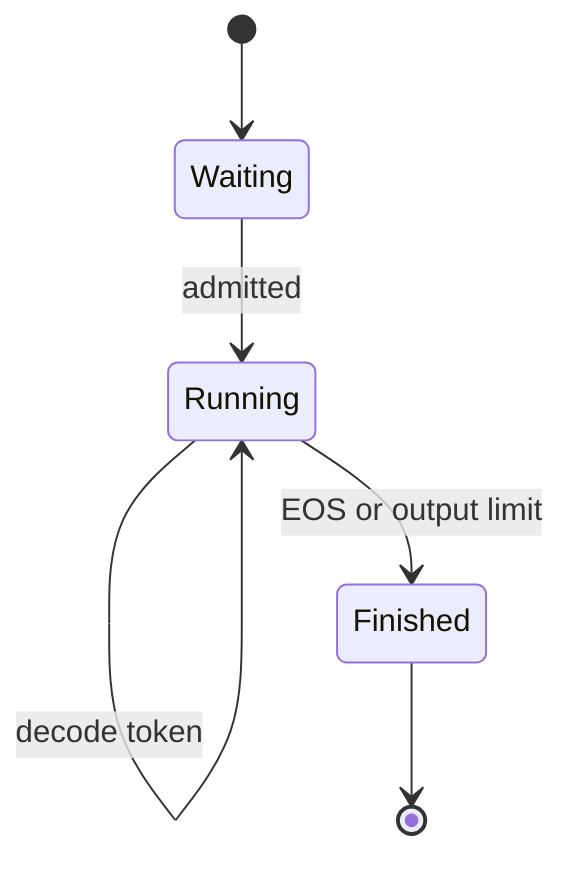

# Continuous batching and paged KV cache

## Request state machine



A request owns prompt tokens, emitted tokens, `num_computed_tokens`, and a
logical block table. An emitted token becomes the next decode input; it is not
considered computed until the following model execution.

## One engine step

```text
admit waiting requests
→ select tokens within the global budget
→ allocate physical KV blocks
→ construct slot mappings
→ execute the selected token batch
→ sample eligible requests
→ commit request state
→ release finished-request blocks
```

## Paged allocation

For `block_size = 4`, a request with logical token positions `0..8` needs three
blocks. Its block table could be `[7, 2, 11]`:

```text
logical token 0 → physical slot 28
logical token 4 → physical slot 8
logical token 8 → physical slot 44
```

The mapping formula is:

```text
logical_block = token_position // block_size
offset        = token_position % block_size
physical_slot = block_table[logical_block] * block_size + offset
```

## Relevant code

- `src/llm_serving_lab/mini_serving/request.py`
- `src/llm_serving_lab/mini_serving/scheduler.py`
- `src/llm_serving_lab/mini_serving/block_manager.py`
- `src/llm_serving_lab/mini_serving/engine.py`
