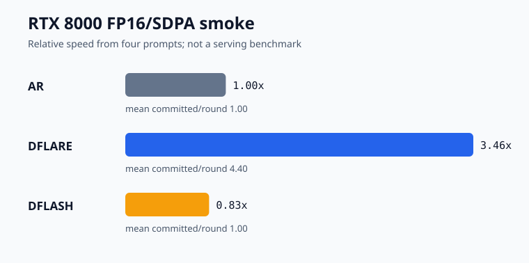

# Stage 5 — AR, DFlash, and DFlare comparison

Status: complete on 2026-09-11.

## Controlled smoke

The three methods used one loaded Qwen3-4B target, greedy temperature 0,
FP16/SDPA, four prompts, and 32 output tokens per prompt. The fourth prompt is
the arithmetic example from the DFlash checkpoint card. Drafts were pinned to:

- DFlare `AngelSlim/Qwen3-4b-dflare@71dcbb0`, block 16, 9 target layers.
- DFlash `z-lab/Qwen3-4B-DFlash-b16@b74e3a3`, block 16, 5 target layers.

| Method | Mean TPOT | Relative to AR | Mean committed/round | Rounds | Exact vs AR |
|---|---:|---:|---:|---:|---:|
| AR | 59.978 ms | 1.00× | 1.00 | 128 | reference |
| DFlash | 71.933 ms | 0.83× | 1.00 | 128 | yes |
| DFlare | 17.322 ms | 3.46× | 4.40 | 30 | yes |

The exact raw result is
[`result.json`](../../results/measured/ar_dflash_dflare_rtx8000_fp16_mixed4/result.json),
and the compact derived artifact is
[`dflare_comparison_rtx8000_fp16.json`](../../results/measured/dflare_comparison_rtx8000_fp16.json).

## Interpretation

On this one RTX 8000 FP16/SDPA run, the DFlash draft accepted no draft token
before the verifier's replacement token, so every round committed one token.
The checkpoint keys match the AngelSlim model class, and its custom checkpoint
code follows the same proposal contract. This is an observed configuration
result, not proof that the checkpoint is generally ineffective.

The official DFlare report uses BF16, FlashAttention, larger benchmark suites,
and different hardware conditions, and reports an average 5.52× Qwen3-4B
wall-clock speedup and roughly 11% over DFlash. Those figures are cited as the
authors' result and are not mixed with the local table.

## What is and is not established

Established:

- Both speculative paths preserve greedy AR token IDs on these four prompts.
- DFlare's accepted-block behavior is visible in the recorded round lengths.
- The external runner can load both official checkpoint families in one process.

Not established:

- Statistical performance ordering across datasets, output lengths, or loads.
- Online serving throughput, latency percentiles, or multi-request interference.
- RTX 4090 BF16/FlashAttention behavior.
- Sampling-distribution equivalence beyond the greedy verifier path.

The next meaningful performance experiment is a fixed dataset with warmup,
randomized method order, repeated trials, confidence intervals, and a separate
4090 result namespace.
